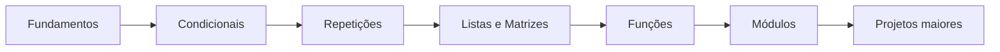

<div align="center">


<a href="https://git.io/typing-svg">
  
</a>

<br>


</div>

---

## 🧭 Navegação rápida

<div align="center">

[](#-atividades-iniciais)
[](#-atividade--fun%C3%A7%C3%B5es-e-m%C3%B3dulos-em-python)
[](#-100-exerc%C3%ADcios-de-l%C3%B3gica-de-programa%C3%A7%C3%A3o)
[](#%EF%B8%8F-como-executar)

</div>

---

## 📖 Sobre o repositório

Este repositório reúne **atividades acadêmicas, exercícios de lógica de programação e soluções desenvolvidas em Python**.

O objetivo é manter um histórico organizado da evolução dos estudos, registrando desde exercícios introdutórios até conteúdos envolvendo funções, módulos, estruturas de decisão, repetição, vetores, matrizes e resolução de problemas.

> 💡 **Objetivo principal:** transformar atividades acadêmicas em um histórico técnico organizado e fácil de consultar.

---

<details>
<summary><b>🗂️ Clique para visualizar a estrutura atual do repositório</b></summary>

<br>

```text
Atividades/
│
├── README.md
├── README_Atividades.md
│
├── atividade_01.py
├── atividade_02.py
├── atividade_03.py
├── atividade_04.py
├── atividade_05.py
│
├── atividades_28/
│   └── 09/
│       ├── 2026/
│       │   └── exe_01.py
│       ├── exe_02.py
│       ├── exe_03.py
│       ├── exe_04.py
│       └── exe_05.py
│
└── PDF100/
    ├── README.md
    └── solucoes/
        ├── ex001_...
        ├── ex002_...
        └── ex100_...
```

</details>

---

## 🧩 Atividades iniciais

| Arquivo | Conteúdo praticado | Acesso |
|---|---|---|
| `atividade_01.py` | Saída de dados com `print()` | [Abrir](./atividade_01.py) |
| `atividade_02.py` | Variáveis, multiplicação e soma | [Abrir](./atividade_02.py) |
| `atividade_03.py` | Divisão, terça parte e diferença | [Abrir](./atividade_03.py) |
| `atividade_04.py` | Variáveis, relações e soma | [Abrir](./atividade_04.py) |
| `atividade_05.py` | Expressões matemáticas | [Abrir](./atividade_05.py) |

---

## 🐍 Atividade — Funções e Módulos em Python

<div align="center">


</div>

A atividade trabalha **funções, parâmetros, retorno de valores, escopo de variáveis e o módulo `math`**.

### 📋 Exercícios

| # | Arquivo | Tema |
|---:|---|---|
| **01** | [`exe_01.py`](./atividades_28/09/2026/exe_01.py) | `math.sqrt()`, `math.ceil()` e `math.floor()` |
| **02** | [`exe_02.py`](./atividades_28/09/exe_02.py) | Área de círculo com `math.pi` |
| **03** | [`exe_03.py`](./atividades_28/09/exe_03.py) | Parâmetros, condicionais e maior de três |
| **04** | [`exe_04.py`](./atividades_28/09/exe_04.py) | Escopo local e global |
| **05** | [`exe_05.py`](./atividades_28/09/exe_05.py) | Hipotenusa e Teorema de Pitágoras |

<details>
<summary><b>🧠 Clique para ver os principais conceitos utilizados</b></summary>

<br>

```text
import
  ↓
definição de funções
  ↓
parâmetros
  ↓
processamento
  ↓
return
  ↓
chamada da função
  ↓
exibição do resultado
```

Também são utilizados:

- `input()` para entrada de dados;
- `int()` e `float()` para conversão de tipos;
- `if`, `elif` e `else` para tomada de decisão;
- f-strings para formatação;
- `**` para potenciação;
- `:.2f` para casas decimais;
- funções e constantes do módulo `math`.

</details>

<details>
<summary><b>🔎 Clique para ver um exemplo de função</b></summary>

<br>

```python
import math

def calcular_hipotenusa(cateto_a, cateto_b):
    hipotenusa = math.sqrt(cateto_a ** 2 + cateto_b ** 2)
    return hipotenusa
```

</details>

---

## 🧠 100 Exercícios de Lógica de Programação

A pasta [`PDF100`](./PDF100) reúne uma sequência extensa de exercícios resolvidos em **Python 3**.

<div align="center">

```text
Entrada e saída
      ↓
Variáveis e operadores
      ↓
Estruturas condicionais
      ↓
Estruturas de repetição
      ↓
Vetores e matrizes
      ↓
Funções
      ↓
Desafios integradores
```

</div>

| Etapa | Conteúdo |
|---|---|
| **01** | Entrada, saída, variáveis e operadores |
| **02** | Estruturas condicionais |
| **03** | Estruturas de repetição |
| **04** | Vetores, listas e matrizes |
| **05** | Funções e desafios integradores |

📘 Documentação completa:

### ➡️ [`PDF100/README.md`](./PDF100/README.md)

---

## 🎯 Conteúdos praticados

<details open>
<summary><b>Fundamentos</b></summary>

- lógica de programação;
- algoritmos;
- entrada e saída de dados;
- variáveis e tipos;
- operadores aritméticos e relacionais.

</details>

<details>
<summary><b>Estruturas de controle</b></summary>

- `if`;
- `elif`;
- `else`;
- `for`;
- `while`;
- validações e decisões.

</details>

<details>
<summary><b>Organização de código</b></summary>

- funções;
- parâmetros;
- retorno de valores;
- escopo local e global;
- módulos da biblioteca padrão;
- decomposição de problemas.

</details>

---

## ▶️ Como executar

<details open>
<summary><b>1️⃣ Clonar o repositório</b></summary>

```bash
git clone https://github.com/DEV-LFS/Atividades.git
```

</details>

<details>
<summary><b>2️⃣ Acessar a pasta</b></summary>

```bash
cd Atividades
```

</details>

<details>
<summary><b>3️⃣ Executar um arquivo</b></summary>

```bash
python atividade_01.py
```

ou:

```bash
python3 atividade_01.py
```

</details>

<details>
<summary><b>4️⃣ Executar a atividade de Funções e Módulos</b></summary>

```bash
python atividades_28/09/exe_05.py
```

</details>

---

## 🛠️ Tecnologias

<div align="center">


</div>

<br>

- **Python 3**
- **Git**
- **GitHub**
- **VS Code**
- biblioteca padrão do Python

> ✅ Os exercícios atuais não exigem bibliotecas externas.

---

## 📈 Evolução



---

## 🚀 Próximos conteúdos

- [ ] Programação Orientada a Objetos
- [ ] Estruturas de Dados
- [ ] Manipulação de Arquivos
- [ ] Tratamento de Exceções
- [ ] Testes Automatizados
- [ ] Banco de Dados
- [ ] Projetos Acadêmicos

---

## 👨‍💻 Autor

<div align="center">

### Luis Felipe Sebastião

[](https://github.com/DEV-LFS)


</div>

---

<div align="center">

### ⭐ Repositório em evolução contínua


</div>
